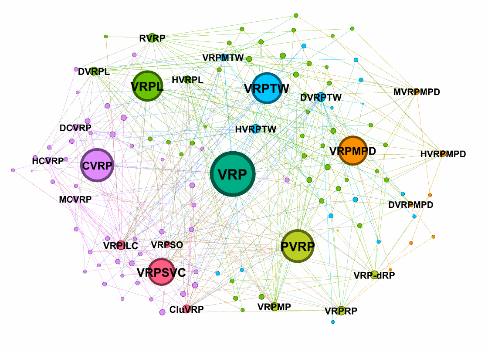

# ARS: Automatic Routing Solver with Large Language Models

**Authors:** Kai Li, Fei Liu, Zhenkun Wang, Xialiang Tong, Xiongwei Han, Mingxuan Yuan, Qingfu Zhang

## Introduction

Real-world Vehicle Routing Problems (VRPs) are characterized by a variety of practical constraints, making manual solver design both knowledge-intensive and time-consuming. Although there is increasing effort in automating the design of routing solvers, existing research has explored only a limited array of VRP variants and fails to adequately address the complex and prevalent constraints encountered in real-world situations.
To fill this gap, we propose the Automatic Routing Solver (ARS), which leverages Large Language Model (LLM) agents to enhance a backbone metaheuristic framework. ARS automatically generates constraint-aware heuristic code from natural language problem descriptions, enabling the framework to handle a wider range of VRP variants without relying on cumbersome modeling rules.
Alongside ARS, we introduce RoutBench, a benchmark comprising 1,000 VRP variants derived from 24 attributes, designed to rigorously evaluate the effectiveness of automatic routing solvers in handling VRPs with diverse practical constraints.


## First Large-Scale VRP Benchmark for Generalization

**RoutBench, a benchmark with 1,000 VRP variants**. 
These VRP variants derived from 24 constraints. These constraints are chosen for their practical significance and theoretical challenges, as highlighted in below. 

This design not only expands the test scale by two orders of magnitude but also provides an opportunity to evaluate algorithms on unseen VRPs.

If an algorithm can effectively solve these unseen problems, it demonstrates the potential to address new real-world challenges, better meeting practical application needs.

| Basic Constraints | VRP Variants |
| :--- | :--- |
| **Vehicle Capacity (C)** | Capacitated VRP (CVRP) |
| | Heterogeneous CVRP (HCVRP) |
| | Multi-Product VRP (MVRP) |
| | Dynamic CVRP (DCVRP) |
| **Distance Limit (L)** | VRP with Distance Limit (VRPL) |
| | Heterogeneous VRPL (HVRPL) |
| | Recharging VRP (RVRP) |
| | Dynamic VRPL (DVRPL) |
| **Time Windows (TW)** | VRP with Time Windows (VRPTW) |
| | Heterogeneous VRPTW (HVRPTW) |
| | VRP with Multiple Time Windows (VRPMTW) |
| | Dynamic VRPTW (DVRPTW) |
| **Pickup and Delivery (PD)** | VRP with Mixed Pickup and Delivery (VRPMPD) |
| | Heterogeneous VRPMPD (HVRPMPD) |
| | Multi-Product VRPMPD (MVRPMPD) |
| | Dynamic VRPMPD (DVRPMPD) |
| **Same Vehicle (S)** | VRP with Same Vehicle Constraint (VRPSVC) |
| | Clustered VRP (CluVRP) |
| | VRP with Sequential Ordering (VRPSO) |
| | VRP with Incompatible Loading Constraint (VRPILC) |
| **Priority (P)** | Precedence constrained VRP (PVRP) |
| | VRP with Relaxed Priority Rules (VRPRP) |
| | VRP with Multiple Priorities (VRPMP) |
| | VRP with d-Relaxed Priority Rule (VRP-dRP) |

## Dataset Construction

The RoutBench is constructed by combinations of six basic constraint types: Vehicle Capacity (C), Distance Limits (L), Time Windows (TW), Pickup and Delivery (PD), Same Vehicle (S), and Priority (P).

<div style="text-align: center;">
    
</div>

Each problem instance is comprised of three components:

1) **The problem description**, which is a natural language explanation of the problem;

2) **The instance data**, including the geometric positions of nodes and the constraint parameters, with data generated using the Solomon C103 dataset as a base;

3) **The validation code**, used to confirm whether a solution adheres to user requirements and satisfies all constraints.

Problem sizes include 25, 50, and 100 nodes. All instances in RoutBench come with Best Known Solutions (BKS), with details provided in our paper.

## Citation

If you use RoutBench or ARS in your work, please cite our paper:

```
@article{li2025ars,
  title={ARS: Automatic Routing Solver with Large Language Models},
  author={Kai Li, Fei Liu, Zhenkun Wang, Xialiang Tong, Xiongwei Han, Mingxuan Yuan, Qingfu Zhang},
  journal={arXiv preprint arXiv:2502.15359},
  year={2025}
}
```

The paper is available on [arXiv](https://arxiv.org/abs/2502.15359).

## Version Information

- **Current Version**: v1.0.1
- **Release Date**: Dec. 5, 2025
